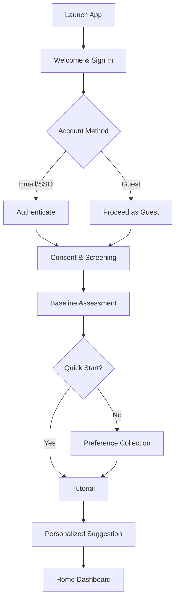
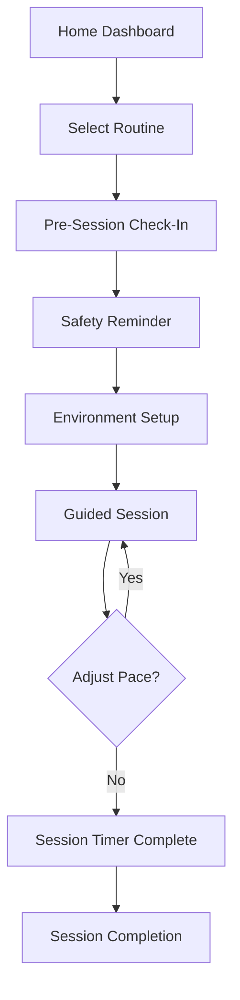
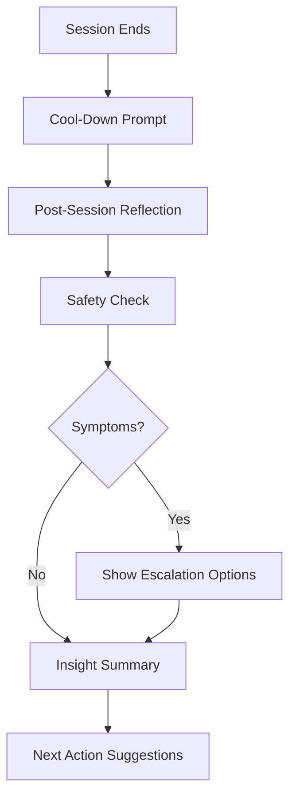
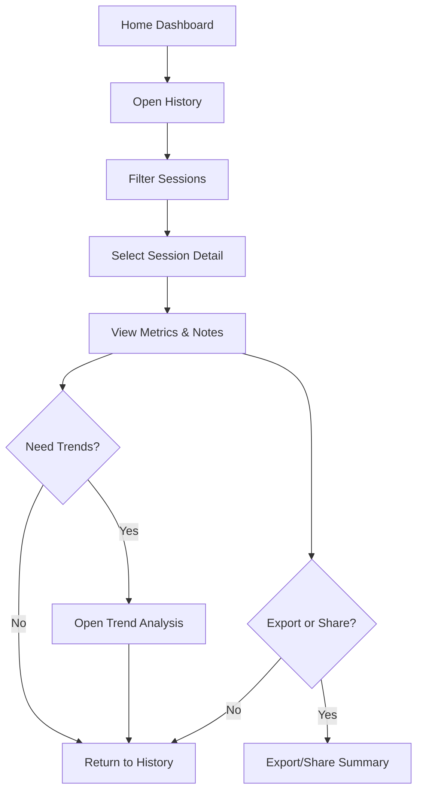

# Breathe User Flow Maps

The following flows capture critical user journeys. Each flow is represented in both step-by-step notation and Mermaid diagrams that can be imported into Figma or Whimsical for visual refinement.

## Onboarding Flow
1. **App Launch** → Display welcome screen with value proposition.
2. **Account Creation** → Offer email, Apple, Google sign-in; optional guest mode.
3. **Consent & Screening** → Present privacy notice, collect contraindication acknowledgements.
4. **Baseline Assessment** → Capture stress level, breathing experience, wellness goals.
5. **Quick Start Decision**
   - If user selects *Quick Start*, skip to tutorial.
   - Else gather detailed preferences (session length, audio/haptics, reminder times).
6. **Tutorial** → Show visual breathing guide, practice cycle with audio/haptic cues.
7. **Personalized Routine Suggestion** → Display recommended routines; allow bookmarking.
8. **Home Dashboard** → Confirm onboarding completion, prompt first session.

## Session Start Flow
1. **Home Dashboard** → User selects routine card.
2. **Pre-Session Check-In** → Record mood, energy, breathing comfort level.
3. **Safety Reminder** → Display symptoms to watch for; confirm readiness.
4. **Environment Setup** → Offer optional timer to prepare, toggle audio/haptics.
5. **Guided Session** → Display breathing animation, play audio cues, vibrate wearable.
6. **Real-Time Adjustment** → Allow pace changes via slider or quick actions.
7. **Session Complete Trigger** → Session time ends or user stops manually.

## Session Completion Flow
1. **Cool-Down Prompt** → Encourage breathing normalization and hydration.
2. **Post-Session Reflection** → Collect stress score, mood, notes.
3. **Safety Check** → Ask about dizziness, discomfort; offer escalation path.
4. **Insight Summary** → Show session metrics, streak updates, recommendations.
5. **Next Action Suggestions** → Provide buttons for repeat session, schedule reminder, share with clinician.

## History Review Flow
1. **Home Dashboard** → User taps “History & Insights.”
2. **History Overview** → Show chronological session list with filters (date, mood, routine type).
3. **Detail View** → Selecting a session reveals metrics, notes, safety incidents.
4. **Trend Analysis** → Optional tab for charts (stress change over time, streaks).
5. **Export/Share** → User exports summary (PDF/CSV) or shares with clinician contact.

## Validation Notes
- Conducted synchronous review with product lead, clinical advisor, and two target users.
- Users requested the Quick Start branch and clearer filter presets in history; incorporated into flows.
- Clinical advisor emphasized explicit symptom list in safety check and escalation options for high-risk reports.
- Stakeholders agreed flows align with MVP scope; requested follow-up usability test after prototype build.

## Next Steps
- Import Mermaid diagrams into Figma using Mermaid-to-SVG plugin for collaborative refinement.
- Annotate screens with copy guidelines before handing to design.
- Prepare usability test script referencing these flows to validate interactions.
